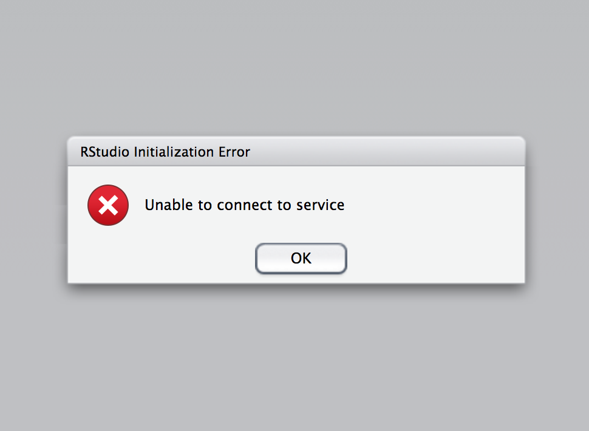
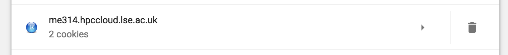

# When you cannot access to Rstudio Server

If you see the following scoreen, close a browser window and remove a cookie from hpccloud.lse.ac.uk, so that you can log in again.

### Google Chrome How to

Follow the instruction here: https://support.google.com/chrome/answer/95647

1. Paste "chrome://settings/siteData" in the browser
2. Find "me314.hpccloud.lse.ac.uk" cookie
    
3. Trash

### Firefox

Follow the instruction here: https://support.mozilla.org/en-US/kb/delete-cookies-remove-info-websites-stored

1. Paste "about:preferences#privacy" in the browser
2. Find "me314.hpccloud.lse.ac.uk" cookie
3. Select it 
4. "Remove selected"
5. "Save"

### Safari

Follow the instruction here: https://support.apple.com/kb/ph21411

1. Follow: Safari > Preferences > Privacy > Manage website data
2. Search and highlight "lse.ac.uk"
3. Remove

### Other browsers

- [Microsoft Edge](https://answers.microsoft.com/en-us/insider/forum/insider_internet-insider_spartan-insiderplat_pc/how-to-view-and-manage-cookies-in-microsoft-edge/67b3a495-554e-4f1d-995e-93d0ea6882a6)
- [Internet Explorer](https://support.microsoft.com/en-gb/help/278835/how-to-delete-cookie-files-in-internet-explorer)
