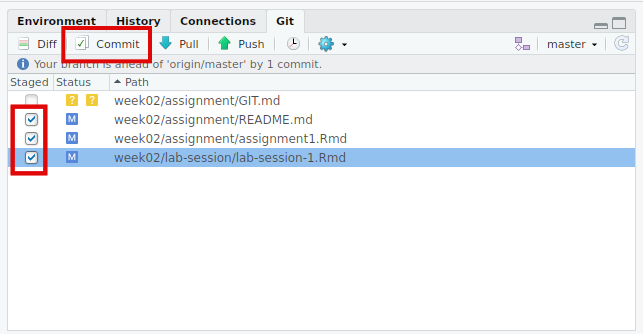
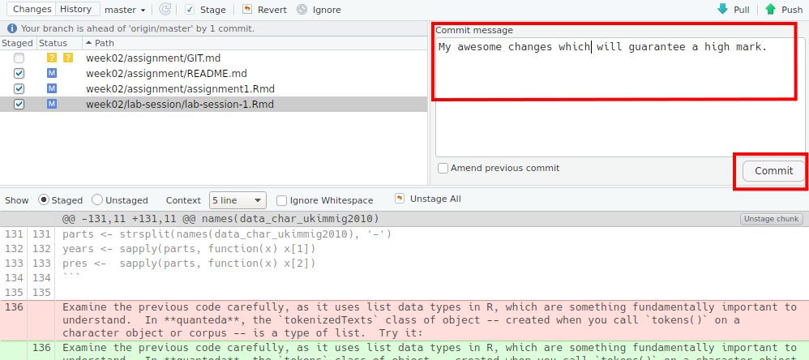
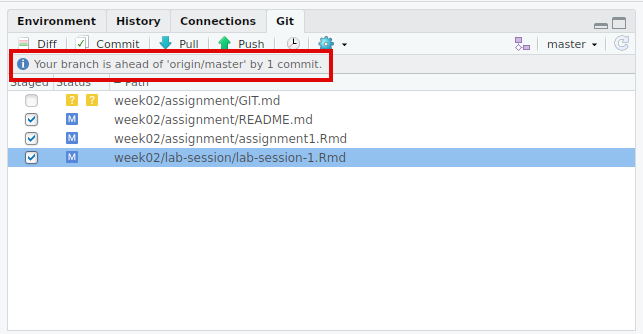

# Git and GitHub Classroom tutorial

### Christian Mueller based on earlier material by Christine Yuen

## How to submit homework

Handing in your homework amounts to committing changes you have made in your repository. There are 3 ways to do it:

##### Use RStudio

1. Select the "Git" tab and check all the files that are changed. Hit the "Commit" button.

    

2. In the window that open, write a commit message. This should be short and describe the changes you made, e.g. "Add code for exercises 1-4, write answers to exercise 5". Then push the "Commit" button.

    

3. Nice, your work is now saved in the git history on your local machine. Now you want to push the changes to GitHub such that we can see the changes and they count for your submission. The message tells you that there are changes on your local machine.

    

4. To push the changes to GitHub, simply click on "Push" and enter the required credentials.

    


##### Use the command line

1. `cd [your github repository location]`
2. `git add "*"`
3. `git commit -m "your comment"`
4. `git push origin master`

Reference:
* https://stackoverflow.com/questions/10364429/how-to-commit-to-remote-git-repository

##### Other ways

1. Update files on Github.com:

    * You can upload your updated files by clicking the "upload files" button (see here: <https://help.github.com/articles/adding-a-file-to-a-repository/>) to replace the outdated files (NOT recommended, you should be able to use the commit and push!)
    * if your files are in some simple format (like .md), you can edit the files directly

2. Email your homework to Ken (NOT recommended, use this ONLY IF you cannot use method 1 or 2)


**It is always a good idea to check if your commits are truly reflected on Github!**

------------------------

## How to update the assignment starting codes / instructions

This is only relevant in the case that instructions change after you started an assignment.

1. Clone your own assignment repository into your own computer if you haven't:

    ```
    git clone https://github.com/[your_user_name]/[your_assignment_repository]/
    ```

2. Change your current directory to the cloned repository if you haven't:

    ```
    cd [your_assignment_repository]
    ```

3. Fetch of the latest assignment instructions from GitHub:

    ```
    git remote add upstream https://github.com/lse-my459/[assignment_instruction_repository]/
    git fetch upstream
    ```

4. Merge the changes in the instructions into your (forked) assignment repository:

    ```
    git merge upstream
    ```


    a. If there are no conflicts ("fast-forward" merge), this is it! You can continue at 6.

    b. If there are conflicts, the previous git command will tell you to resolve the changes and commit them back.

    Look at the output of the previous command. It will tell you which file was not merged cleanly. Open this file in a text editor and resolve the issues by hand. Use `git diff [your file]` to check what changed since your last commit. When you resolved the differences, use these two commands to commit all the changes in the current working directory.

    ```
    git add "*"
    git commit -a -m "Merge changes from central homework repository"
    ```

6. Push the merge to your GitHub repository:

    ```
    git push
    ```

Reference: <https://help.github.com/articles/merging-an-upstream-repository-into-your-fork/>
